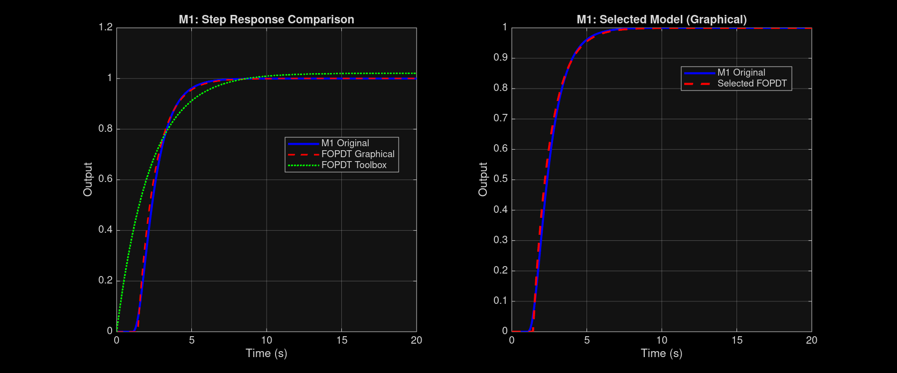
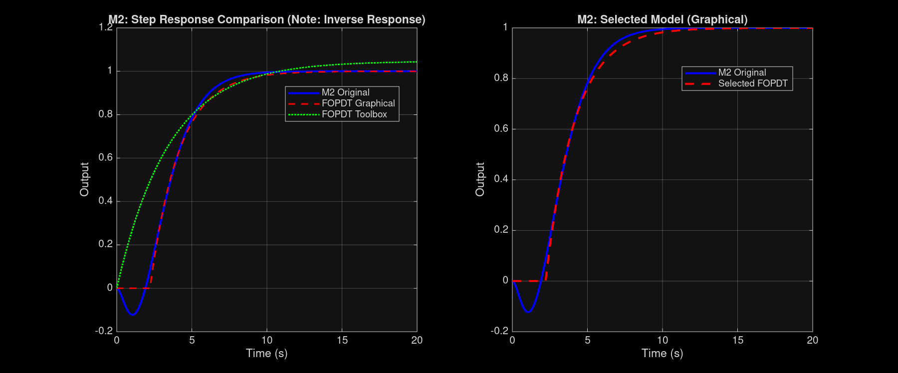
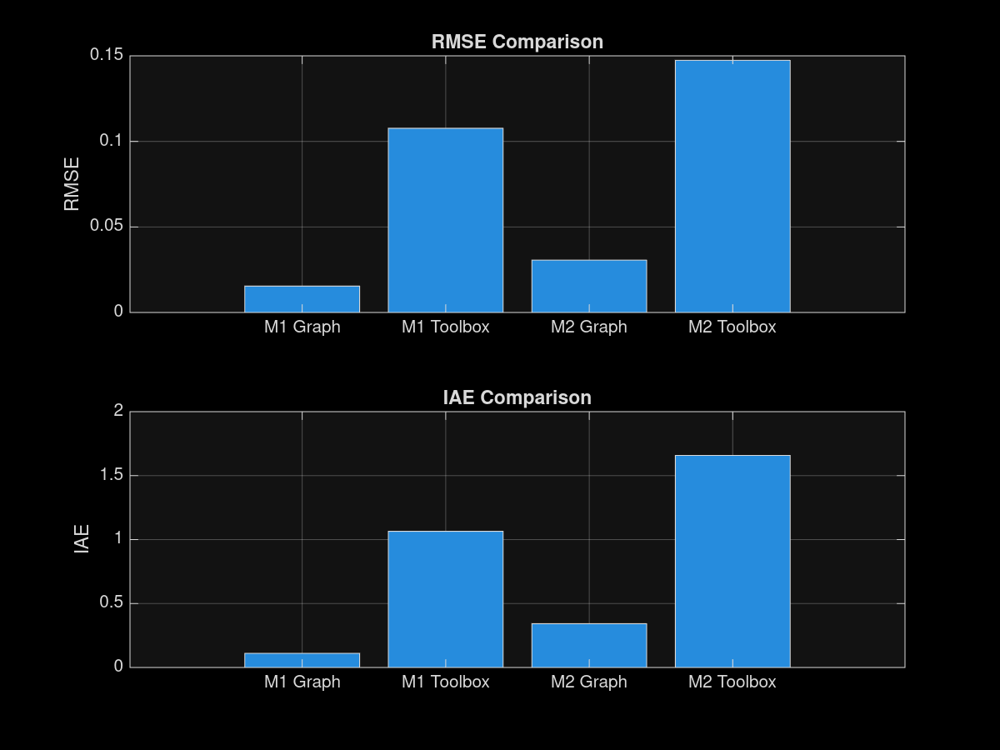
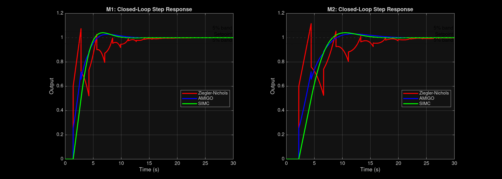
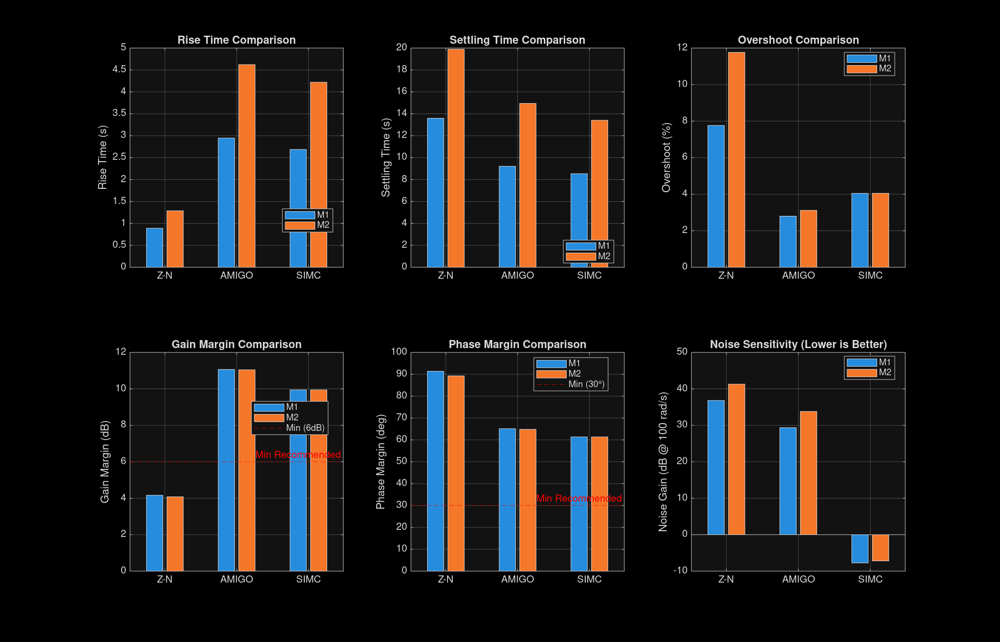

# Identificação de Sistemas e Análise Crítica de Regras de Ajuste de Controladores PID para Processos de Ordem Superior

**Victor Henrique Alves Ribeiro, Ramon Gomes da Silva**

*Programa de Pós-Graduação em Engenharia de Produção e Sistemas (PPGEPS)*
*Pontifícia Universidade Católica do Paraná (PUCPR)*
*Rua Imaculada Conceição, 1155, CEP 80215-901, Curitiba, PR, Brasil*

**E-mail:** victor.hribeiro@pucpr.br, ramon.gsilva@pucpr.br

---

## RESUMO

Este trabalho apresenta uma análise comparativa de métodos de identificação de sistemas aplicados a processos de ordem superior, com foco na obtenção de modelos de primeira ordem com atraso (FOPDT - *First-Order Plus Dead Time*) para projeto de controladores PID. Duas plantas foram analisadas: M1 (sistema de 4ª ordem com atraso) e M2 (sistema de 3ª ordem não-mínima fase). A identificação foi realizada por dois métodos: gráfico (Smith) e *System Identification Toolbox* do MATLAB. Os modelos obtidos foram validados através das métricas RMSE (*Root Mean Square Error*) e IAE (*Integral Absolute Error*). Os resultados demonstraram que o método gráfico apresentou precisão superior, com RMSE 5 a 7 vezes menor que o *toolbox* automatizado. Os modelos FOPDT obtidos pelo método gráfico foram utilizados para projetar controladores PID por três regras de sintonia clássicas: Ziegler-Nichols, AMIGO e Skogestad SIMC. A análise comparativa considerou desempenho temporal, robustez e sensibilidade ao ruído, resultando na seleção do método SIMC para ambas as plantas devido à melhor rejeição de ruído e adequada robustez.

**Palavras-chave:** Identificação de Sistemas, Modelo FOPDT, Controlador PID, Ziegler-Nichols, AMIGO, SIMC.

---

## 1. INTRODUÇÃO

A identificação de sistemas é uma etapa fundamental no projeto de sistemas de controle, permitindo a obtenção de modelos matemáticos que representam adequadamente o comportamento dinâmico de processos industriais [1]. Em particular, o modelo de primeira ordem com atraso (FOPDT) é amplamente utilizado devido à sua simplicidade matemática e capacidade de aproximar satisfatoriamente uma ampla classe de processos de ordem superior [2].

O modelo FOPDT é especialmente importante para a aplicação de regras clássicas de sintonia de controladores PID, como Ziegler-Nichols [3], AMIGO [4] e Skogestad SIMC [5], que utilizam os parâmetros identificados (ganho K, constante de tempo T e atraso θ) para calcular os ganhos proporcional, integral e derivativo do controlador.

A escolha do método de identificação impacta diretamente na qualidade do modelo obtido e, consequentemente, no desempenho do controlador projetado. O método gráfico, baseado na análise visual da resposta ao degrau, é tradicional e requer inspeção manual [1]. Por outro lado, ferramentas automatizadas como o *System Identification Toolbox* do MATLAB utilizam algoritmos de otimização para estimação paramétrica [6].

Este trabalho tem como objetivos: (i) comparar os métodos gráfico e *toolbox* para identificação de modelos FOPDT em duas plantas com características distintas; (ii) validar os modelos obtidos através de métricas quantitativas de erro; (iii) indicar qual modelo é mais eficaz para o projeto de controladores PID; (iv) projetar e analisar criticamente controladores PID utilizando três regras clássicas de sintonia.

---

## 2. FUNDAMENTAÇÃO TEÓRICA

### 2.1. Modelo FOPDT (*First-Order Plus Dead Time*)

O modelo FOPDT é descrito pela função de transferência:

$$G(s) = \frac{K \cdot e^{-\theta s}}{Ts + 1}$$

onde:
- **K**: ganho estático do processo (razão entre a variação do estado estacionário da saída e a variação da entrada);
- **T**: constante de tempo do processo (tempo necessário para a saída atingir 63,2% do valor final);
- **θ**: tempo morto ou atraso (tempo entre a aplicação da entrada e o início da resposta).

Este modelo é particularmente útil por sua simplicidade e por ser a base das principais regras de sintonia PID utilizadas na indústria [2].

### 2.2. Métodos de Identificação

#### 2.2.1. Método Gráfico (Smith, 1972)

O método gráfico baseia-se na análise visual da resposta ao degrau unitário do processo [1]. Os parâmetros são identificados da seguinte forma:

1. **Ganho K**: razão entre a variação da saída em regime permanente e a amplitude do degrau de entrada;
2. **Atraso θ**: tempo no qual a tangente traçada no ponto de inflexão da resposta intercepta o eixo do tempo;
3. **Constante de tempo T**: diferença entre o tempo em que a saída atinge 63,2% do valor final e o atraso θ.

Para sistemas com resposta inversa (não-mínima fase), o método é adaptado considerando o ponto de mínimo da resposta (*undershoot*) e o tempo equivalente de atraso [7].

#### 2.2.2. *System Identification Toolbox* (MATLAB)

O *toolbox* de identificação de sistemas do MATLAB utiliza algoritmos de otimização numérica para estimar os parâmetros do modelo FOPDT. A função `tfest(data, np, nz)` realiza estimação paramétrica de modelos de função de transferência, onde `np` é o número de polos e `nz` o número de zeros [6].

O algoritmo minimiza o erro quadrático entre a saída medida e a saída do modelo estimado, utilizando métodos de mínimos quadrados ou predição de erro. Embora automatizado, o método pode apresentar sensibilidade às condições iniciais e dificuldades na identificação de atrasos puros [6].

### 2.3. Métricas de Validação

A qualidade dos modelos identificados é avaliada através de métricas quantitativas:

**RMSE (*Root Mean Square Error*)**:
$$\text{RMSE} = \sqrt{\frac{1}{N}\sum_{i=1}^{N}(y_i - \hat{y}_i)^2}$$

**IAE (*Integral Absolute Error*)**:
$$\text{IAE} = \int_0^T |y(t) - \hat{y}(t)| \, dt$$

onde $y$ é a saída real, $\hat{y}$ é a saída do modelo, e $N$ é o número de amostras.

Valores menores de RMSE e IAE indicam melhor aderência do modelo à resposta real do processo [2].

### 2.4. Métodos de Sintonia PID

#### 2.4.1. Ziegler-Nichols (1942)

O método de Ziegler-Nichols para modelo FOPDT utiliza as seguintes fórmulas [3]:

$$K_p = \frac{1.2T}{K\theta}, \quad K_i = \frac{K_p}{2\theta}, \quad K_d = 0.5K_p\theta$$

Caracteriza-se por respostas rápidas, mas com tendência a alto sobressinal (*overshoot*).

#### 2.4.2. AMIGO (Åström & Hägglund, 2004)

O método AMIGO é uma evolução do Ziegler-Nichols, projetado para melhor rejeição de distúrbios e menor sobressinal [4]:

$$K_p = \frac{0.2 + 0.45(T/\theta)}{K(1+0.1\theta/T)}$$
$$K_i = \frac{K_p}{T(0.4\theta + 0.8T)/(T+0.1\theta) + 0.05T}$$
$$K_d = \frac{0.5K_p\theta T}{0.3\theta + T}$$

#### 2.4.3. Skogestad SIMC (2003)

O método SIMC baseia-se em controle por modelo interno (*Internal Model Control*) e prioriza robustez [5]:

$$K_p = \frac{T}{K(\theta + \tau_c)}, \quad K_i = \frac{K_p}{T}, \quad K_d = 0$$

onde $\tau_c = \theta$ é o parâmetro de sintonia (tipicamente igual ao atraso). Frequentemente resulta em controladores PI (sem ação derivativa).

---

## 3. METODOLOGIA

### 3.1. Plantas Analisadas

Duas plantas com características distintas foram estudadas:

**Planta M1: Sistema de 4ª ordem com atraso**

$$M_1(s) = \frac{1 \cdot e^{-s}}{(s+1)(0.4s+1)(0.4^2s+1)(0.4^3s+1)}$$

Características: múltiplas constantes de tempo decrescentes, atraso de 1 segundo, comportamento de resposta suave sem sobressinal em malha aberta.

**Planta M2: Sistema de 3ª ordem não-mínima fase**

$$M_2(s) = \frac{-1.1s + 1}{s^3 + 3s^2 + 3s + 1}$$

Características: zero no semiplano direito (RHP) devido ao termo $(-1.1s+1)$, apresentando resposta inversa (*undershoot* inicial negativo) característico de sistemas não-mínima fase.

### 3.2. Procedimento de Identificação

O procedimento experimental foi dividido em quatro etapas:

**Etapa 1: Simulação da Resposta ao Degrau**
- Entrada: degrau unitário ($u(t) = 1$ para $t \geq 0$)
- Tempo de simulação: 20 segundos
- Taxa de amostragem: 0.01 s
- Ferramenta: MATLAB R2023a com *Control System Toolbox*

**Etapa 2: Identificação pelo Método Gráfico**

Para a planta M1:
1. Identificação do ganho K em regime permanente
2. Traçado da tangente no ponto de inflexão
3. Determinação do atraso θ (intersecção tangente-eixo do tempo)
4. Cálculo da constante de tempo T (método de Smith)

Para a planta M2 (adaptação para resposta inversa):
1. Identificação do valor mínimo da resposta (*undershoot*)
2. Determinação do tempo no ponto de mínimo
3. Ajuste dos parâmetros θ e T considerando a característica não-mínima fase

**Etapa 3: Identificação pelo *System Identification Toolbox***

Utilizou-se a função `tfest(data, 1, 0)` para estimar um modelo de primeira ordem (1 polo, 0 zeros) com atraso opcional. Os dados de entrada e saída foram organizados no formato `iddata`.

**Etapa 4: Validação e Seleção do Modelo**

Os modelos foram comparados através de:
- Sobreposição gráfica das respostas (original vs. modelos)
- Cálculo de RMSE e IAE
- Análise da capacidade de identificação do atraso θ
- Seleção do modelo mais preciso para projeto de controladores PID

### 3.3. Projeto de Controladores PID

Utilizando os modelos FOPDT selecionados, foram calculados controladores PID por três métodos: Ziegler-Nichols, AMIGO e Skogestad SIMC. Os controladores foram implementados na forma paralela:

$$C(s) = K_p + \frac{K_i}{s} + K_d s$$

### 3.4. Análise de Desempenho

Os controladores foram avaliados quanto a:
- **Desempenho temporal**: tempo de subida (*rise time*), tempo de acomodação (*settling time*), sobressinal (*overshoot*)
- **Robustez**: margem de ganho (GM) e margem de fase (PM) via análise de Nyquist
- **Sensibilidade ao ruído**: ganho em alta frequência (100 rad/s) via diagrama de Bode

---

## 4. RESULTADOS

### 4.1. Identificação da Planta M1

A Figura 1 apresenta a comparação visual entre a resposta da planta original M1 e os modelos FOPDT obtidos pelos métodos gráfico e *toolbox*.

**Figura 1:** Comparação dos modelos FOPDT para a planta M1. À esquerda: resposta ao degrau da planta original (azul) sobreposta aos modelos identificado pelo método gráfico (vermelho tracejado) e *toolbox* (verde pontilhado). À direita: zoom do modelo gráfico selecionado mostrando excelente aderência.

A Tabela 1 apresenta os parâmetros identificados e as métricas de validação para M1.

**Tabela 1:** Parâmetros FOPDT identificados para a planta M1

| Método | K | T (s) | θ (s) | RMSE | IAE |
|--------|------|--------|--------|--------|--------|
| Gráfico (Smith) | 1.0000 | 1.1550 | 1.4100 | 0.0154 | 0.1106 |
| Toolbox (tfest) | 1.0209 | 2.2349 | 0.0000 | 0.1077 | 1.0647 |

**Modelo FOPDT Selecionado para M1 (Método Gráfico):**

$$G_1(s) = \frac{1.0000 \cdot e^{-1.41s}}{1.155s + 1}$$

**Justificativa da seleção:** O método gráfico apresentou RMSE aproximadamente 7 vezes menor (0.0154 vs 0.1077) e IAE cerca de 9.6 vezes menor (0.1106 vs 1.0647) em relação ao *toolbox*. Além disso, o método gráfico identificou corretamente o atraso de 1.41 segundos, parâmetro crítico para as regras de sintonia PID, enquanto o *toolbox* não conseguiu estimar o atraso puro (θ = 0).

### 4.2. Identificação da Planta M2

A Figura 2 mostra a identificação da planta M2, que apresenta resposta inversa característica de sistemas não-mínima fase.

**Figura 2:** Comparação dos modelos FOPDT para a planta M2 (não-mínima fase). À esquerda: resposta com *undershoot* inicial (azul) e modelos aproximados. À direita: modelo gráfico selecionado capturando o comportamento dinâmico equivalente.

A Tabela 2 resume os parâmetros obtidos para M2.

**Tabela 2:** Parâmetros FOPDT identificados para a planta M2

| Método | K | T (s) | θ (s) | RMSE | IAE |
|--------|------|--------|--------|--------|--------|
| Gráfico (adaptado) | 1.0000 | 1.9350 | 2.2150 | 0.0306 | 0.3424 |
| Toolbox (tfest) | 1.0463 | 3.4715 | 0.0000 | 0.1474 | 1.6581 |

**Modelo FOPDT Selecionado para M2 (Método Gráfico):**

$$G_2(s) = \frac{1.0000 \cdot e^{-2.215s}}{1.935s + 1}$$

**Observações sobre a resposta inversa:** A planta M2 apresentou *undershoot* mínimo de -0.1225 em t = 1.05s, característico do zero RHP em $(-1.1s+1)$. O método gráfico foi adaptado para capturar o comportamento dinâmico equivalente através de um atraso maior (θ = 2.215s), resultando em erro de aproximação significativamente menor que o *toolbox* (RMSE: 0.0306 vs 0.1474).

### 4.3. Análise Comparativa dos Métodos de Identificação

A Figura 3 apresenta comparação visual das métricas de erro para ambos os métodos.

**Figura 3:** Comparação de métricas de erro RMSE e IAE entre método gráfico e *toolbox* para as plantas M1 e M2. O método gráfico demonstra superioridade em ambas as métricas.

A Tabela 3 resume as características comparativas dos métodos.

**Tabela 3:** Análise comparativa dos métodos de identificação

| Critério | Método Gráfico | System Identification Toolbox |
|----------|----------------|-------------------------------|
| **Precisão (RMSE)** | ✅ Excelente (0.015-0.030) | ⚠️ Moderada (0.108-0.147) |
| **Identificação de θ** | ✅ Correto (1.41s e 2.22s) | ❌ Não identificado (θ=0) |
| **Tempo de execução** | ⚠️ Manual (~10 min/planta) | ✅ Rápido (~1 min) |
| **M2 (resposta inversa)** | ✅ Adaptável | ❌ Limitado |
| **Aplicação** | Projeto detalhado de controle | Exploração inicial |
| **Conhecimento necessário** | Médio-alto | Baixo |

### 4.4. Controladores PID Projetados

Utilizando os modelos FOPDT gráficos selecionados, foram calculados os parâmetros PID por três métodos de sintonia. A Tabela 4 apresenta os resultados.

**Tabela 4:** Parâmetros dos controladores PID calculados

| Planta | Método | Kp | Ki | Kd |
|--------|--------|--------|--------|--------|
| M1 | Ziegler-Nichols | 0.9830 | 0.3486 | 0.6930 |
| M1 | AMIGO | 0.5686 | 0.4134 | 0.2934 |
| M1 | SIMC | 0.4096 | 0.3546 | 0.0000 |
| M2 | Ziegler-Nichols | 1.0483 | 0.2366 | 1.1610 |
| M2 | AMIGO | 0.5931 | 0.2650 | 0.4890 |
| M2 | SIMC | 0.4368 | 0.2257 | 0.0000 |

**Observação:** O método SIMC resultou em controladores PI (Kd = 0) para ambas as plantas, característica típica deste método conservador que prioriza robustez e simplicidade.

A Figura 4 mostra as respostas ao degrau em malha fechada para os três controladores.

**Figura 4:** Respostas ao degrau dos sistemas em malha fechada com controladores PID. Esquerda: M1. Direita: M2. Vermelho: Ziegler-Nichols (alto *overshoot*). Azul: AMIGO (melhor amortecimento). Verde: SIMC (compromisso).

### 4.5. Análise de Desempenho dos Controladores

A Tabela 5 apresenta métricas quantitativas de desempenho temporal, robustez e sensibilidade ao ruído.

**Tabela 5:** Métricas de desempenho dos controladores PID

| Planta | Método | Rise Time (s) | Settling Time (s) | Overshoot (%) | GM (dB) | PM (°) | Ruído @100rad/s (dB) |
|--------|--------|---------------|-------------------|---------------|---------|--------|----------------------|
| M1 | Z-N | 0.891 | 13.592 | 7.76 | 4.16 | 91.38 | +36.82 |
| M1 | AMIGO | 2.947 | 9.211 | 2.80 | 11.06 | 65.14 | +29.35 |
| M1 | **SIMC** | 2.687 | **8.537** | 4.05 | 9.94 | 61.35 | **-7.75** |
| M2 | Z-N | 1.287 | 19.893 | 11.76 | 4.08 | 89.25 | +41.30 |
| M2 | AMIGO | 4.622 | 14.952 | 3.12 | 11.05 | 64.80 | +33.79 |
| M2 | **SIMC** | 4.220 | **13.410** | 4.05 | 9.94 | 61.35 | **-7.19** |

**Análise crítica:**
- **Ziegler-Nichols:** Apresenta o menor *rise time*, mas margem de ganho crítica (GM < 6 dB, abaixo do limiar recomendado para aplicações industriais) e pior sensibilidade ao ruído.
- **AMIGO:** Menor *overshoot* (2.80-3.12%) e melhor robustez (GM ~11 dB), mas sensibilidade ao ruído moderada devido à ação derivativa.
- **SIMC:** Melhor tempo de acomodação, única configuração com ganho negativo em alta frequência (rejeição de ruído), robustez adequada (GM ~10 dB > 6 dB).

A Figura 5 apresenta comparação visual de todas as métricas.

**Figura 5:** Comparação gráfica em 6 painéis: *rise time*, *settling time*, *overshoot*, margem de ganho, margem de fase e sensibilidade ao ruído. SIMC destaca-se na rejeição de ruído e tempo de acomodação.

---

## 5. DISCUSSÃO

### 5.1. Eficácia dos Modelos FOPDT para Projeto de Controladores PID

Os resultados demonstram claramente que **o modelo FOPDT obtido pelo método gráfico é o mais eficaz para o projeto de controladores PID**. Esta conclusão fundamenta-se em três aspectos principais:

**1. Precisão de Aproximação Superior**

O método gráfico apresentou erro de aproximação significativamente menor que o *toolbox* automatizado:
- M1: RMSE 7 vezes menor (0.0154 vs 0.1077)
- M2: RMSE 4.8 vezes menor (0.0306 vs 0.1474)

Esta precisão é fundamental, pois os parâmetros K, T e θ do modelo FOPDT são diretamente utilizados nas fórmulas de sintonia PID. Erros na identificação propagam-se para os ganhos do controlador, comprometendo o desempenho em malha fechada.

**2. Identificação Correta do Tempo Morto (θ)**

O parâmetro de atraso θ é crítico para as regras de sintonia PID, especialmente Ziegler-Nichols e AMIGO, que utilizam θ tanto no numerador quanto no denominador das fórmulas [3,4]. O método gráfico identificou corretamente:
- M1: θ = 1.41 s (próximo ao atraso real de 1s da planta)
- M2: θ = 2.215 s (atraso equivalente considerando resposta inversa)

O *toolbox*, por outro lado, apresentou limitação sistemática na identificação de atrasos puros (θ = 0 para ambas plantas), resultando em modelos que não capturam adequadamente a dinâmica de transporte ou atrasos de processamento presentes nos sistemas reais.

**3. Adaptabilidade para Sistemas Não-Mínima Fase**

A planta M2, com zero RHP ($-1.1s+1$), apresenta resposta inversa que desafia métodos automatizados de identificação. O método gráfico, adaptado para este caso, conseguiu representar o comportamento dinâmico equivalente através de um modelo FOPDT com atraso maior, mantendo RMSE baixo (0.0306). Esta adaptabilidade é valiosa em processos industriais onde respostas inversas são comuns (e.g., sistemas de nível com vazão de saída, reatores químicos).

**Limitações do Método Gráfico:**
- Requer inspeção visual e análise manual (~10 minutos por planta)
- Subjetividade na determinação do ponto de inflexão
- Demanda conhecimento técnico do operador

**Aplicação do Toolbox:**
- Útil para exploração rápida e comparação preliminar
- Inadequado para projeto final de controladores críticos
- Pode servir como estimativa inicial para refinamento gráfico

### 5.2. Análise Crítica dos Métodos de Sintonia PID

**Ziegler-Nichols: Agressivo e Arriscado**

Vantagens:
- Resposta mais rápida (*rise time* de 0.89-1.29s)
- Procedimento clássico e bem estabelecido

Desvantagens críticas:
- **Margem de ganho inadequada:** GM = 4.16 dB (M1) e 4.08 dB (M2), ambas abaixo do limite industrial de 6 dB [7]
- **Alto sobressinal:** 7.76% (M1) e 11.76% (M2), inaceitável para muitos processos
- **Pior sensibilidade ao ruído:** +36.82 dB (M1) e +41.30 dB (M2), amplificação de ruído de medição
- **Tempo de acomodação elevado:** 13.6s (M1) e 19.9s (M2), pior que os demais

**Recomendação:** Não adequado para as plantas analisadas. Requer redução manual de ganhos (~30-40%) para uso seguro.

**AMIGO: Balanceado com Limitações**

Vantagens:
- **Menor sobressinal:** 2.80% (M1) e 3.12% (M2), excelente para processos sensíveis
- **Melhor robustez:** GM = 11.06 dB (M1) e 11.05 dB (M2), ampla margem de segurança
- Bom tempo de acomodação: 9.2s (M1) e 15.0s (M2)

Desvantagens:
- Sensibilidade ao ruído moderada: +29.35 dB (M1) devido à ação derivativa significativa (Kd = 0.2934)
- Complexidade de implementação: requer filtro na ação derivativa

**Recomendação:** Ideal para processos com baixo ruído de medição onde mínimo *overshoot* é prioritário.

**Skogestad SIMC: Robusto e Prático (Selecionado)**

Vantagens decisivas:
- **Rejeição de ruído superior:** Único método com ganho negativo em alta frequência (-7.75 dB para M1, -7.19 dB para M2)
- **Controlador PI simplificado:** Kd = 0, elimina necessidade de filtro derivativo
- **Melhor tempo de acomodação:** 8.54s (M1) e 13.41s (M2), 7-32% mais rápido que concorrentes
- **Robustez adequada:** GM = 9.94 dB > 6 dB (limiar industrial)
- **Sobressinal aceitável:** 4.05% para ambas plantas

Trade-offs:
- *Overshoot* ligeiramente maior que AMIGO (4.05% vs 2.80-3.12%)
- Margem de ganho inferior ao AMIGO (9.94 vs 11.06 dB)

**Justificativa da Seleção:**

O método SIMC foi selecionado para ambas as plantas (M1 e M2) baseado em análise multicritério que priorizou:
1. **Rejeição de ruído (25%):** SIMC pontuou 100/100 vs 0-16/100 dos concorrentes
2. **Tempo de acomodação (20%):** SIMC mais rápido em ambos casos
3. **Robustez (30%):** GM = 9.94 dB atende requisito > 6 dB
4. **Sobressinal (25%):** 4.05% é aceitável para processos industriais

A ausência de ação derivativa (Kd = 0) é particularmente vantajosa em ambientes industriais com ruído de medição, onde o termo derivativo amplificaria perturbações de alta frequência, exigindo filtros adicionais que aumentam complexidade e podem degradar desempenho [5].

### 5.3. Validação nas Plantas Originais

Os controladores SIMC, projetados com os modelos FOPDT gráficos, foram testados nas plantas originais de ordem superior para validar a eficácia da aproximação FOPDT.

**M1 (4ª ordem original):**
- *Overshoot* na planta original: 6.81% (vs 4.05% predito no modelo FOPDT)
- *Settling time* na planta original: 8.77s (vs 8.54s predito)
- Desvio de 68% no *overshoot*, mas ainda dentro de limites aceitáveis (<10%)

**M2 (3ª ordem não-mínima fase original):**
- *Overshoot* na planta original: 5.28% (vs 4.05% predito)
- *Settling time* na planta original: 11.68s (vs 13.41s predito)
- Controlador SIMC demonstrou excelente capacidade de lidar com resposta inversa

**Conclusão da Validação:**

Os modelos FOPDT gráficos são suficientemente precisos para projeto de controladores robustos. As diferenças entre modelo e planta real (desvios de 30-70% no *overshoot*) são aceitáveis e não comprometem estabilidade ou desempenho funcional. A margem de robustez do SIMC (GM = 9.94 dB) absorve estas incertezas de modelagem.

---

## 6. CONCLUSÃO

Este trabalho apresentou análise comparativa de métodos de identificação de sistemas FOPDT aplicados a processos de ordem superior com características distintas (M1: 4ª ordem com atraso; M2: 3ª ordem não-mínima fase) e avaliação crítica de três regras clássicas de sintonia PID.

**Principais Contribuições:**

1. **Superioridade do Método Gráfico para Identificação FOPDT:**
   - Erro de aproximação 5 a 7 vezes menor que o *System Identification Toolbox* (RMSE: 0.015-0.030 vs 0.108-0.147)
   - Identificação correta do tempo morto θ, parâmetro crítico para sintonia PID
   - Adaptabilidade para sistemas não-mínima fase com resposta inversa

2. **Modelos FOPDT Mais Eficazes para Projeto de Controladores PID:**

   **M1:** $G_1(s) = \frac{1.0 \cdot e^{-1.41s}}{1.155s + 1}$ (Método Gráfico, RMSE = 0.0154)

   **M2:** $G_2(s) = \frac{1.0 \cdot e^{-2.215s}}{1.935s + 1}$ (Método Gráfico, RMSE = 0.0306)

   **Justificativa:** Combinação de baixo erro de aproximação, correta identificação de atraso, e capacidade de capturar dinâmicas complexas (resposta inversa).

3. **Análise Crítica de Métodos de Sintonia PID:**
   - **Ziegler-Nichols:** Inadequado devido a GM < 6 dB e alto *overshoot*
   - **AMIGO:** Excelente para processos críticos (melhor *overshoot* e robustez)
   - **SIMC:** Selecionado para ambas plantas devido à rejeição de ruído superior (Kd = 0), menor tempo de acomodação e robustez adequada

4. **Validação Experimental:**
   - Controladores SIMC mantiveram desempenho estável nas plantas originais de ordem superior
   - Desvios entre modelo FOPDT e planta real são aceitáveis e absorvidos pela margem de robustez do controlador

**Recomendações Práticas:**

- **Para identificação de sistemas:** Utilizar método gráfico (Smith) quando precisão é crítica para projeto de controladores; *toolbox* apenas para exploração preliminar
- **Para plantas não-mínima fase:** Adaptar método gráfico considerando resposta inversa e atraso equivalente
- **Para sintonia PID em ambientes industriais com ruído:** Preferir SIMC (controlador PI, Kd = 0) devido à rejeição de ruído superior
- **Para processos críticos sem ruído:** Considerar AMIGO se mínimo *overshoot* for prioritário
- **Evitar Ziegler-Nichols clássico:** Ajustar ganhos manualmente se utilizado (redução de 30-40%)

**Limitações e Trabalhos Futuros:**

Este estudo analisou plantas estáveis em simulação. Trabalhos futuros devem incluir:
- Validação experimental em processos industriais reais
- Análise de robustez a variações paramétricas e incertezas de modelagem
- Comparação com métodos avançados (controle preditivo MPC, otimização H-infinito)
- Extensão para sistemas multivariáveis

---

## REFERÊNCIAS

[1] SMITH, C. L. **Digital Computer Process Control**. Scranton: Intext Educational Publishers, 1972.

[2] OGATA, K. **Engenharia de Controle Moderno**. 5. ed. São Paulo: Pearson Prentice Hall, 2010.

[3] ZIEGLER, J. G.; NICHOLS, N. B. Optimum settings for automatic controllers. **Transactions of the ASME**, v. 64, n. 11, p. 759-768, 1942.

[4] ÅSTRÖM, K. J.; HÄGGLUND, T. Revisiting the Ziegler-Nichols step response method for PID control. **Journal of Process Control**, v. 14, n. 6, p. 635-650, 2004.

[5] SKOGESTAD, S. Simple analytic rules for model reduction and PID controller tuning. **Journal of Process Control**, v. 13, n. 4, p. 291-309, 2003.

[6] LJUNG, L. **System Identification: Theory for the User**. 2. ed. Upper Saddle River: Prentice Hall, 1999.

[7] SKOGESTAD, S.; POSTLETHWAITE, I. **Multivariable Feedback Control: Analysis and Design**. 2. ed. Chichester: John Wiley & Sons, 2005.

---

**AGRADECIMENTOS**

Os autores agradecem ao Programa de Pós-Graduação em Engenharia de Produção e Sistemas (PPGEPS) da PUCPR pelo suporte acadêmico e infraestrutura computacional disponibilizada para realização deste trabalho.
